# AiNspire Software Architecture

## 1. System Overview

AiNspire is a bilingual AI-readiness platform for Telekom Malaysia. Employees complete a 20-question assessment, receive a deterministic readiness score and progressive AI contribution profile, and are given AI learning and project recommendations. HR users can view workforce analytics and generate team action plans.

```text
+-------------------------+          +------------------------------+
| Employee / HR Browser   |          | GitHub Pages Frontend         |
| React + Vite            |          | tm-ai-persona                  |
+------------+------------+          +---------------+--------------+
             |                                       |
             | Local development: /api via proxy     |
             | Production: VITE_API_URL              |
             v                                       v
+------------------------------------------------------------------+
| Express API Server                                               |
| artifacts/api-server                                             |
|                                                                  |
| /api/healthz          /api/classify        /api/action-plan       |
| /api/youtube-thumbnail/:videoId                                  |
+----------------------+----------------------+--------------------+
                       |                      |
                       v                      v
             +-------------------+   +-----------------------------+
             | Deterministic     |   | Agent + MCP workflow         |
             | readiness scoring |   | In-process MCP client/server |
             | assessmentScore.ts|   | lib/agent.ts + lib/mcp.ts   |
             +-------------------+   +--------------+--------------+
                                                    |
                         +--------------------------+--------------------------+
                         |                          |                          |
                         v                          v                          v
                 +---------------+          +---------------+          +---------------+
                 | TM AI Gateway |          | YouTube Data  |          | Thumbnail     |
                 | OAuth + LLM   |          | API v3        |          | proxy         |
                 | lib/llm.ts    |          | primary/backup|          | routes/youtube|
                 +---------------+          +---------------+          +---------------+
```

## 2. Repository Structure

```text
v1/
├── artifacts/
│   ├── tm-ai-persona/                 # React/Vite browser application
│   │   ├── src/App.tsx                 # Assessment state and API orchestration
│   │   ├── src/components/             # Screens and reusable UI
│   │   ├── src/data/                   # Assessment questions and content
│   │   ├── src/i18n.ts                 # EN/BM interface translations
│   │   └── vite.config.ts              # Local API proxy and production build
│   │
│   └── api-server/                    # Express/TypeScript backend
│       └── src/
│           ├── app.ts                  # Middleware and /api mounting
│           ├── index.ts                # Server bootstrap
│           ├── routes/                  # HTTP route handlers
│           └── lib/                     # Scoring, agent, MCP, LLM integrations
│
├── lib/                               # Shared API, schema, and database packages
├── .github/workflows/deploy.yml       # GitHub Pages frontend deployment
├── render.yaml                         # Render API service definition
├── .env.example                        # Local environment variable template
└── README.md
```

## 3. Frontend Architecture

```text
+-----------------------+
| App.tsx               |
|                       |
| landing              |
|   -> department      |
|   -> assessment       |
|   -> pledge           |
|   -> ai-loading       |
|   -> results          |
|   -> report           |
+-----------+-----------+
            |
            +--> runClassify(EN)
            |       |
            |       +--> cache EN result
            |       |
            |       +--> runClassify(BM, referenceResult=EN)
            |               |
            |               +--> cache BM result
            |
            +--> ResultsScreen
            |       +--> profile and readiness cards
            |       +--> narrative and reasoning
            |       +--> learning videos
            |       +--> next steps
            |
            +--> HRDashboard
                    +--> workforce distribution
                    +--> skills gaps
                    +--> /api/action-plan
```

The frontend keeps the EN and BM results in a language-keyed cache. The first classification is always English. BM receives the complete EN response as `referenceResult`, so the backend can translate the canonical result rather than independently reclassifying the employee.

## 4. API Layer

```text
HTTP request
    |
    v
Express app (app.ts)
    |
    +--> pino HTTP logging
    +--> CORS
    +--> JSON/urlencoded body parsing
    +--> /api router
            |
            +--> health.ts
            |      GET /api/healthz
            |
            +--> classify.ts
            |      POST /api/classify
            |
            +--> actionPlan.ts
            |      POST /api/action-plan
            |
            +--> youtube.ts
                         GET /api/youtube-thumbnail/:videoId
                     |
                     +--> events.ts
                         POST /api/events
```

### `POST /api/classify`

```text
20 assessment answers + department + role + language
                         |
                         v
              calculateReadinessScores()
                         |
                         +--> overall readiness percentage
                         +--> six dimension scores
                         +--> persona scores
                         +--> progressive persona
                              Explorer  0-54%
                              Builder   55-69%
                              Strategist 70-84%
                              Visionary 85-100%
                         |
                         +--> language == EN
                         |       |
                         |       +--> runReadinessAgent()
                         |               +--> MCP context
                         |               +--> LLM narrative
                         |
                         +--> language == BM + EN reference
                                 |
                                 +--> translate narrative fields to BM
                                 +--> translate recommendations to BM
                                 +--> copy persona/scores/videos from EN
                                 +--> preserve recommendation count/order
```

### `POST /api/action-plan`

```text
distribution + teamSize + division + skillsGap
                         |
                         v
       workforce planning MCP workflow
                         |
                         v
                TM AI Gateway LLM
                         |
                         v
       3-phase, 90-day HR action plan JSON
```

### `GET /api/youtube-thumbnail/:videoId`

```text
Browser image request
        |
        v
Validate YouTube video ID
        |
        v
https://img.youtube.com/vi/:videoId/hqdefault.jpg
        |
        v
Same-origin image response with cache headers
```

## 5. Readiness Agent and MCP Workflow

The MCP server and client run in-process using the official TypeScript MCP SDK and `InMemoryTransport`.

```text
runReadinessMcpWorkflow()
        |
        +--> calculate_readiness_score
        |       +--> deterministic dimension/persona scores
        |
        +--> get_workforce_context
        |       +--> department and role context
        |       +--> governance guidance
        |
        +--> find_project_matches
        |       +--> department-specific project matches
        |       +--> strongest dimensions
        |
        +--> get_learning_pathway
                +--> lowest readiness dimensions
                +--> learning priorities
                +--> YouTube recommendations
```

The LLM is instructed to explain the deterministic score and grounded MCP context. It does not override the deterministic persona selection.

## 6. Bilingual Result Flow

```text
                 +----------------+
                 | EN classify    |
                 | Full analysis   |
                 +--------+-------+
                          |
                          | canonical referenceResult
                          v
                 +----------------+
                 | BM translation|
                 |               |
                 | chunk A: text |
                 | chunk B: recs |
                 +--------+-------+
                          |
                          v
                 +-------------------------------+
                 | BM response                   |
                 |                               |
                 | Translated: narrative fields  |
                 | Translated: recommendation    |
                 |                               |
                 | Copied from EN:               |
                 | persona, confidence, scores,  |
                 | video metadata, order/count   |
                 +-------------------------------+
```

BM translation is deliberately not a second classification. Translation calls are split into smaller JSON responses to reduce truncation risk. If a translation chunk is malformed or truncated, it is retried and then falls back to the corresponding EN text while preserving the canonical result structure.

## 7. YouTube Recommendation Architecture

```text
get_learning_pathway
        |
        +--> determine three weakest dimensions
        |
        +--> search using:
        |       role + department + persona + learning topic
        |
        +--> primary key: YOUTUBE_API_KEY
        |       |
        |       +--> HTTP 200: use response
        |       +--> HTTP 403/429: try backup key
        |
        +--> backup key: YOUTUBE_API_KEY_BACKUP
        |
        +--> fetch search results
        +--> fetch video details and embeddability
        +--> filter for relevant English training content
        +--> deduplicate by video URL
        +--> return normalized video metadata
```

Video metadata is attached to EN recommendations and copied unchanged into BM. This keeps the same videos, thumbnails, links, channels, and durations in both languages.

## 8. Environment and Secrets

```text
Local development
v1/.env
    |
    +--> TM_APIGATE_CLIENT_ID
    +--> TM_APIGATE_CLIENT_SECRET
    +--> TM_APIGATE_CHAT_KEY
    +--> TM_LLM_MODEL
    +--> YOUTUBE_API_KEY
    +--> YOUTUBE_API_KEY_BACKUP

Production
Render environment variables
    |
    +--> API server reads secrets at process startup
    +--> GitHub Pages build receives VITE_API_URL
```

`.env` is gitignored. Real API keys and gateway credentials must never be committed. The backup YouTube key must be configured separately in the Render service environment.

## 9. Deployment Architecture

```text
Developer
   |
   v
GitHub main branch
   |
   +------------------------------+
   |                              |
   v                              v
GitHub Actions                  Render
frontend build                  API build and service
   |                              |
   v                              v
GitHub Pages                    https://ainspire-dev-v1.onrender.com
https://shahrilnizam-25.github.io/ainspire-dev-v1/
```

### Local development

```text
Browser :3000
    |
    | relative /api request
    v
Vite proxy :3000/api
    |
    v
Express :3001
```

### Production

```text
GitHub Pages frontend
    |
    | VITE_API_URL=https://ainspire-dev-v1.onrender.com
    v
Render API service
    |
    +--> TM AI Gateway
    +--> YouTube Data API v3
    +--> YouTube thumbnail origin
```

## 10. Reliability Boundaries

- Deterministic scoring remains available even when LLM JSON is invalid.
- EN is the canonical semantic result for bilingual parity.
- BM translation is isolated from classification and never changes persona or scores.
- BM translation chunks retry independently.
- YouTube search falls back to a second API key on quota/auth responses (`403`/`429`).
- Video recommendations are deduplicated before returning to the frontend.
- Thumbnails are served through a same-origin proxy with cache headers.
- Validation rejects incomplete classifications with HTTP `400`.
- API requests and completion durations are logged through Pino.

## 11. Validation Commands

```sh
cd v1
pnpm --dir artifacts/api-server typecheck
pnpm --dir artifacts/api-server test
pnpm --dir artifacts/tm-ai-persona build
```

## 12. Entity Relationship Diagram

The proposed schema is connected through `assessment_sessions`. This is the
central transaction record for one employee assessment journey. The existing
repository does not yet contain these tables; this is the target relational
model for implementation.

```mermaid
erDiagram
    ORGANIZATIONS ||--o{ USERS : contains
    ORGANIZATIONS ||--o{ DEPARTMENTS : owns
    ORGANIZATIONS ||--o{ WORKFORCE_MEMBERS : employs

    DEPARTMENTS ||--o{ ROLES : offers
    DEPARTMENTS ||--o{ PROJECTS : owns
    ROLES ||--o{ WORKFORCE_MEMBERS : classifies

    ASSESSMENT_VERSIONS ||--o{ ASSESSMENT_QUESTIONS : defines
    READINESS_DIMENSIONS ||--o{ ASSESSMENT_QUESTIONS : measures
    ASSESSMENT_QUESTIONS ||--o{ ASSESSMENT_OPTIONS : provides

    USERS ||--o{ ASSESSMENT_SESSIONS : completes
    ORGANIZATIONS ||--o{ ASSESSMENT_SESSIONS : scopes
    ASSESSMENT_VERSIONS ||--o{ ASSESSMENT_SESSIONS : uses
    DEPARTMENTS ||--o{ ASSESSMENT_SESSIONS : selected_for
    ROLES ||--o{ ASSESSMENT_SESSIONS : selected_role

    ASSESSMENT_SESSIONS ||--o{ ASSESSMENT_ANSWERS : contains
    ASSESSMENT_QUESTIONS ||--o{ ASSESSMENT_ANSWERS : answered
    ASSESSMENT_OPTIONS ||--o{ ASSESSMENT_ANSWERS : selected
    ASSESSMENT_SESSIONS ||--o{ ASSESSMENT_CONSENTS : records
    ASSESSMENT_SESSIONS ||--o{ OPEN_RESPONSES : includes

    LANGUAGES ||--o{ ASSESSMENT_RESULTS : localizes
    ASSESSMENT_SESSIONS ||--o{ ASSESSMENT_RESULTS : produces
    PERSONAS ||--o{ ASSESSMENT_RESULTS : assigns
    ASSESSMENT_VERSIONS ||--o{ PERSONA_READINESS_BANDS : configures
    PERSONAS ||--o{ PERSONA_READINESS_BANDS : defines

    ASSESSMENT_RESULTS ||--o{ RESULT_DIMENSION_SCORES : contains
    READINESS_DIMENSIONS ||--o{ RESULT_DIMENSION_SCORES : scores
    ASSESSMENT_RESULTS ||--o{ RESULT_PERSONA_SCORES : calculates
    PERSONAS ||--o{ RESULT_PERSONA_SCORES : scores
    ASSESSMENT_RESULTS ||--o{ RESULT_RECOMMENDATIONS : generates
    READINESS_DIMENSIONS ||--o{ RESULT_RECOMMENDATIONS : targets
    RESULT_RECOMMENDATIONS ||--o| RECOMMENDATION_VIDEOS : may_include

    PROJECTS ||--o{ PROJECT_DIMENSION_MAPPINGS : matches
    READINESS_DIMENSIONS ||--o{ PROJECT_DIMENSION_MAPPINGS : supports
    READINESS_DIMENSIONS ||--o{ LEARNING_TOPICS : guides

    WORKFORCE_MEMBERS ||--o{ WORKFORCE_ASSESSMENT_LINKS : has
    ASSESSMENT_SESSIONS ||--o{ WORKFORCE_ASSESSMENT_LINKS : links
    ORGANIZATIONS ||--o{ WORKFORCE_SNAPSHOTS : snapshots
    DEPARTMENTS ||--o{ WORKFORCE_SNAPSHOTS : groups
    WORKFORCE_SNAPSHOTS ||--o{ WORKFORCE_PERSONA_DISTRIBUTIONS : summarizes
    PERSONAS ||--o{ WORKFORCE_PERSONA_DISTRIBUTIONS : counts

    ORGANIZATIONS ||--o{ ACTION_PLANS : owns
    USERS ||--o{ ACTION_PLANS : creates
    WORKFORCE_SNAPSHOTS ||--o{ ACTION_PLANS : informs
    ACTION_PLANS ||--o{ ACTION_PLAN_PHASES : contains
    ACTION_PLAN_PHASES ||--o{ ACTION_PLAN_ACTIONS : contains

    USERS ||--o{ ANALYTICS_EVENTS : generates
    ASSESSMENT_SESSIONS ||--o{ ANALYTICS_EVENTS : tracks
    ASSESSMENT_RESULTS ||--o{ ANALYTICS_EVENTS : observes
    RESULT_RECOMMENDATIONS ||--o{ ANALYTICS_EVENTS : clicked
    ACTION_PLANS ||--o{ ANALYTICS_EVENTS : observes

    ORGANIZATIONS {
        uuid id PK
        string code UK
        string name
    }

    USERS {
        uuid id PK
        uuid organization_id FK
        string employee_number
        string email
        string user_type
    }

    ASSESSMENT_SESSIONS {
        uuid id PK
        uuid user_id FK
        uuid organization_id FK
        uuid assessment_version_id FK
        uuid department_id FK
        uuid role_id FK
        string submitted_role_name
        string status
        timestamp submitted_at
    }

    ASSESSMENT_ANSWERS {
        uuid id PK
        uuid assessment_session_id FK
        uuid question_id FK
        uuid selected_option_id FK
        integer score
        integer time_to_answer_ms
    }

    ASSESSMENT_RESULTS {
        uuid id PK
        uuid assessment_session_id FK
        string language_code FK
        boolean is_canonical
        string persona_code FK
        integer overall_readiness
        decimal confidence
        string generation_status
    }

    RESULT_DIMENSION_SCORES {
        uuid id PK
        uuid assessment_result_id FK
        uuid dimension_id FK
        integer percentage
    }

    RESULT_RECOMMENDATIONS {
        uuid id PK
        uuid assessment_result_id FK
        integer sequence_number
        string recommendation_type
        string source
    }

    RECOMMENDATION_VIDEOS {
        uuid id PK
        uuid recommendation_id FK
        string video_id
        string video_url
        string thumbnail_url
        string youtube_api_source
    }

    ANALYTICS_EVENTS {
        bigserial id PK
        uuid event_id UK
        uuid assessment_session_id FK
        string event_name
        string screen_name
        jsonb properties
        timestamp occurred_at
    }
```



### Relationship rules

```text
Organization
  ├── Users
  ├── Departments ─── Roles
  ├── Workforce members
  └── Action plans / workforce snapshots

Assessment version
  └── Questions ─── Options
                  └── Readiness dimension

Assessment session
  ├── Answers
  ├── Consents
  ├── Open responses
  ├── EN result  [canonical]
  │     ├── Dimension scores
  │     ├── Persona scores
  │     └── Recommendations ─── Video metadata
  ├── BM result  [derived translation]
  └── Analytics events
```

### Required constraints

- `assessment_sessions.id` is the primary correlation key for the complete user journey.
- `assessment_answers` should have a unique constraint on `(assessment_session_id, question_id)`.
- `assessment_results` should have a unique constraint on `(assessment_session_id, language_code)`.
- Only one result per session should have `is_canonical = true`; that result is the EN result.
- `result_dimension_scores` should be unique on `(assessment_result_id, dimension_id)`.
- `result_recommendations` should be unique on `(assessment_result_id, sequence_number)`.
- `recommendation_videos.video_id` should be indexed for deduplication.
- `analytics_events.event_id` should be globally unique and append-only.
- Historical results must retain their `assessment_version_id`, prompt version, and model name.

The most important relationship is therefore:

```text
assessment_sessions
    -> assessment_answers
    -> assessment_results (EN and BM)
    -> result_dimension_scores
    -> result_persona_scores
    -> result_recommendations
    -> recommendation_videos
    -> analytics_events
```
